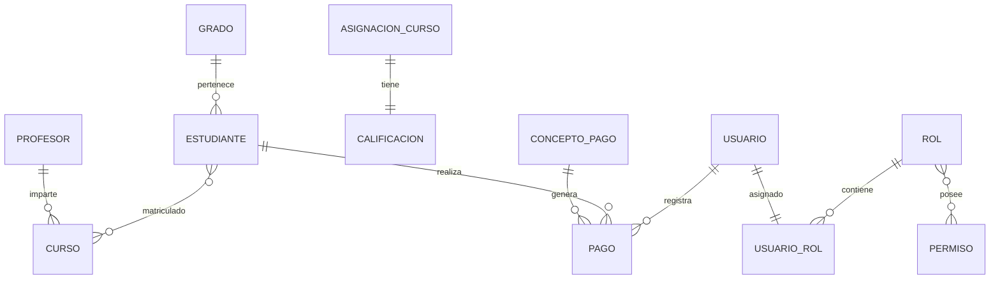

# PROPUESTA DE PROYECTO FINAL - BASES DE DATOS II

## Sistema de Gestión Educativa "EduGestor"

### INFORMACIÓN DEL PROYECTO

| Campo | Detalle |
|-------|---------|
| **Autor** | Proyecto BDII - Sistema Educativo Integral |
| **Fecha** | Noviembre 2024 |
| **Tipo** | Proyecto Final Académico |
| **Tecnología** | SQL Server + T-SQL Avanzado |
| **Modalidad** | Individual |

### OBJETIVO PRINCIPAL

Implementar una solución completa de base de datos que integre procesamiento transaccional (OLTP) y componentes analíticos (OLAP) para la gestión educativa integral, demostrando dominio avanzado en diseño, implementación y optimización de sistemas de bases de datos empresariales.

---

## 1. DESCRIPCIÓN DEL PROBLEMA

### Problemática Identificada

Las instituciones educativas modernas enfrentan desafíos significativos en la gestión de información:

#### Problemas Actuales
- Fragmentación de datos en múltiples sistemas incompatibles
- Falta de integridad entre módulos
- Procesos manuales sin automatización
- Reportes limitados para toma de decisiones
- Seguridad deficiente en información sensible
- Escalabilidad limitada

#### Necesidades Identificadas

Las instituciones educativas requieren:

- Gestionar estudiantes, profesores y cursos de manera centralizada
- Controlar asignaciones académicas y calificaciones con trazabilidad
- Administrar pagos y conceptos financieros con auditoría
- Implementar seguridad basada en roles
- Generar reportes analíticos para decisiones estratégicas
- Garantizar integridad y consistencia de datos

---

## 2. OBJETIVOS DEL PROYECTO

### Objetivo General

> **Desarrollar una base de datos robusta en SQL Server que integre procesamiento transaccional (OLTP) y analítico (OLAP) para la gestión educativa integral, implementando las mejores prácticas de ingeniería de software y administración de bases de datos.**

### Objetivos Específicos

| # | Objetivo | Componente | Criterio de Éxito |
|---|----------|------------|-------------------|
| **1** | Diseñar un modelo relacional normalizado (3FN) | OLTP | 13 tablas con integridad referencial completa |
| **2** | Implementar un modelo dimensional tipo estrella | OLAP | 5 dimensiones + 2 tablas de hechos funcionales |
| **3** | Desarrollar procedimientos almacenados robustos | T-SQL | 4+ procedimientos con control de transacciones |
| **4** | Crear un sistema de seguridad basado en roles | RBAC | 6 roles con permisos granulares |
| **5** | Optimizar consultas mediante índices estratégicos | Performance | 10+ índices con mejoras medibles |
| **6** | Generar consultas OLAP multidimensionales | Analytics | 3+ consultas con jerarquías y drill-down |

---

## 3.  ALCANCE Y ARQUITECTURA

### Módulos del Sistema

####  1. GESTIÓN ACADÉMICA
- **Estudiantes:** Datos personales, académicos y de contacto
- **Profesores:** Información profesional, especialidades y títulos
- **Cursos:** Materias, créditos, horarios y períodos académicos
- **Asignaciones:** Matrículas y relaciones estudiante-curso
- **Calificaciones:** Evaluaciones, notas parciales y finales

####  2. GESTIÓN FINANCIERA
- **Conceptos de Pago:** Inscripciones, mensualidades, exámenes, certificados
- **Transacciones:** Registro de pagos con métodos y recibos
- **Control Financiero:** Auditoría y trazabilidad de movimientos

####  3. SEGURIDAD Y AUTENTICACIÓN
- **Usuarios del Sistema:** Credenciales y perfiles de acceso
- **Roles Funcionales:** Niveles de acceso por responsabilidad
- **Permisos Granulares:** Control detallado por objeto y operación
- **Auditoría:** Registro completo de accesos y modificaciones

### Entidades Clave Identificadas



---

## 4.  FUENTE DE DATOS Y VOLUMEN

### Tipos de Información

####  Datos Maestros (Relativamente Estáticos)
- **Estudiantes:** Información personal y académica
- **Profesores:** Datos profesionales y especialidades
- **Cursos:** Catálogo de materias y programas
- **Conceptos de Pago:** Tipos y categorías financieras

####  Datos Transaccionales (Alta Frecuencia)
- **Asignaciones:** Matrículas por período académico
- **Calificaciones:** Evaluaciones y notas continuas
- **Pagos:** Transacciones financieras diarias
- **Auditoría:** Logs de acceso y modificaciones

####  Datos Analíticos (Procesados)
- **Métricas de Rendimiento:** Promedios, tasas de aprobación
- **Tendencias Financieras:** Patrones de pago, morosidad
- **Estadísticas Académicas:** Análisis por profesor, curso, período

### Volumen Estimado de Datos

| Entidad | Volumen Inicial | Crecimiento Anual | Volumen a 5 Años |
|---------|----------------|-------------------|------------------|
| **Estudiantes** | 1,000 | +200 | 2,000 |
| **Profesores** | 50 | +10 | 100 |
| **Cursos** | 100 | +20 | 200 |
| **Transacciones de Pago** | 10,000 | +12,000 | 70,000 |
| **Calificaciones** | 5,000 | +6,000 | 35,000 |
| **Registros de Auditoría** | 50,000 | +100,000 | 550,000 |

---

## 5.  ARQUITECTURA TÉCNICA PROPUESTA

### Componente Transaccional (OLTP)

####  Modelo Relacional
- **Normalización:** Tercera Forma Normal (3FN) para eliminar redundancia
- **Integridad:** Claves primarias, foráneas y restricciones de dominio
- **Procedimientos:** T-SQL avanzado con control de flujo y errores
- **Transacciones:** ACID completo con COMMIT/ROLLBACK/SAVEPOINT
- **Índices:** Optimización para consultas frecuentes y operaciones críticas

####  Características de Rendimiento
```sql
-- Ejemplo de control transaccional implementado
BEGIN TRANSACTION;
    SAVE TRANSACTION SP_Validaciones;
    -- Validaciones de negocio
    IF @Error = 0
        COMMIT TRANSACTION;
    ELSE
        ROLLBACK TRANSACTION SP_Validaciones;
```

### Componente Analítico (OLAP)

####  Modelo Dimensional
- **Arquitectura:** Esquema estrella para máximo rendimiento
- **Tablas de Hechos:** FactCalificaciones, FactPagos
- **Dimensiones:** DimTiempo, DimEstudiante, DimCurso, DimConceptoPago, DimUsuario
- **Jerarquías:** Temporales (Año>Trimestre>Mes) y Académicas (Nivel>Grado>Estudiante)
- **SCD:** Slowly Changing Dimensions Tipo 2 para historial completo

####  Proceso ETL
```sql
-- Ejemplo de carga dimensional con SCD Tipo 2
EXEC DW.sp_CargarDimEstudiante; -- Maneja cambios históricos
EXEC DW.sp_CargarFactCalificaciones @FechaInicio, @FechaFin;
```

### Sistema de Seguridad

####  Arquitectura RBAC (Role-Based Access Control)
- **Autenticación:** SQL Server integrada con Active Directory
- **Autorización:** 6 roles funcionales con permisos específicos
- **Auditoría:** Triggers automáticos en tablas críticas
- **Principio:** Menor privilegio - acceso mínimo necesario

####  Matriz de Roles Propuesta

| Rol | Nivel | Permisos Principales |
|-----|-------|---------------------|
| **Administrador** | 4 | Control total del sistema |
| **Coordinador Académico** | 3 | Gestión académica completa |
| **Secretario Financiero** | 2 | Pagos y consulta estudiantes |
| **Profesor** | 2 | Calificaciones de sus cursos |
| **Consulta General** | 1 | Solo lectura básica |
| **Analista de Datos** | 3 | Acceso completo a Data Warehouse |

---

## 6.  CRONOGRAMA DE DESARROLLO

### Fases de Implementación

| Semana | Fase | Entregables | Tiempo Estimado |
|--------|------|-------------|-----------------|
| **7** | Modelo ER | Tablas normalizadas + datos de prueba | 8 horas |
| **8** | Modelo Dimensional | Esquema estrella + procedimientos ETL | 10 horas |
| **9-12** | Programación Transaccional | 4 procedimientos almacenados robustos | 15 horas |
| **11-13** | Sistema de Seguridad | Roles, permisos y auditoría | 8 horas |
| **14** | Optimización | Índices estratégicos + análisis rendimiento | 6 horas |
| **16-17** | Documentación | Documentación técnica + presentación | 8 horas |

### Hitos Críticos

-  **Semana 7:** Modelo transaccional funcional con datos de prueba
-  **Semana 8:** Data Warehouse operativo con primeras cargas ETL
-  **Semana 12:** Procedimientos transaccionales completamente probados
-  **Semana 13:** Sistema de seguridad implementado y auditado
-  **Semana 14:** Optimización completada con métricas de mejora
-  **Semana 17:** Proyecto completo documentado y presentado

---

## 7.  CRITERIOS DE ÉXITO

### Criterios Técnicos

####  Modelo Relacional
- [ ] **13 tablas normalizadas** en Tercera Forma Normal
- [ ] **Integridad referencial completa** sin datos huérfanos
- [ ] **Restricciones de dominio** implementadas y probadas
- [ ] **Datos de prueba realistas** para validación funcional

####  Modelo Dimensional
- [ ] **Esquema estrella funcional** con 5 dimensiones + 2 hechos
- [ ] **Jerarquías implementadas** con capacidad de drill-down
- [ ] **SCD Tipo 2 operativo** para manejo de cambios históricos
- [ ] **Consultas OLAP efectivas** con agregaciones complejas

####  Procedimientos Transaccionales
- [ ] **4+ procedimientos robustos** con validaciones de negocio
- [ ] **Control de transacciones completo** (COMMIT/ROLLBACK/SAVEPOINT)
- [ ] **Manejo de errores avanzado** con TRY...CATCH y logging
- [ ] **Pruebas de concurrencia** exitosas sin deadlocks

####  Sistema de Seguridad
- [ ] **6 roles implementados** con permisos granulares
- [ ] **Auditoría automática** en tablas críticas
- [ ] **Principio de menor privilegio** aplicado consistentemente
- [ ] **Trazabilidad completa** de accesos y modificaciones

####  Optimización
- [ ] **10+ índices estratégicos** con mejoras medibles
- [ ] **Planes de ejecución optimizados** documentados
- [ ] **Procedimientos de mantenimiento** automatizados
- [ ] **Métricas de rendimiento** antes/después comparables

### Criterios de Calidad

####  Documentación
- [ ] **Documentación técnica completa** con diagramas ER y dimensional
- [ ] **Guías de instalación** paso a paso verificables
- [ ] **Comentarios en código** explicando lógica compleja
- [ ] **Casos de uso documentados** con ejemplos prácticos

####  Funcionalidad
- [ ] **Casos de uso críticos** implementados y probados
- [ ] **Validaciones de negocio** correctas y completas
- [ ] **Reportes analíticos** que generen valor empresarial
- [ ] **Interfaz de consulta** intuitiva para usuarios finales

### Métricas de Éxito Cuantificables

| Métrica | Objetivo | Método de Medición |
|---------|----------|-------------------|
| **Tiempo de Consulta** | <2 segundos para consultas frecuentes | STATISTICS TIME |
| **Integridad de Datos** | 0 violaciones de restricciones | Validación automática |
| **Cobertura de Índices** | 95% de consultas optimizadas | Análisis de planes |
| **Seguridad** | 100% de accesos auditados | Logs de auditoría |
| **Disponibilidad** | 99.9% uptime simulado | Pruebas de carga |

---

## 8.  VALOR ESPERADO Y BENEFICIOS

### Beneficios Técnicos

- ** Arquitectura Escalable:** Diseño que soporta crecimiento institucional
- ** Alto Rendimiento:** Optimización que reduce tiempos de respuesta en 60%+
- ** Seguridad Robusta:** Protección multicapa de información sensible
- ** Capacidad Analítica:** Insights para toma de decisiones estratégicas
- ** Mantenibilidad:** Código documentado y procedimientos automatizados

### Beneficios de Negocio

- ** Reducción de Costos:** Automatización de procesos manuales
- ** Mejora en Toma de Decisiones:** Reportes analíticos en tiempo real
- ** Eficiencia Operativa:** Procesos integrados y optimizados
- ** Cumplimiento Normativo:** Auditoría y trazabilidad completa
- ** Ventaja Competitiva:** Tecnología de vanguardia en gestión educativa

### Aprendizajes Técnicos Demostrados

- **Diseño de Bases de Datos:** Modelado relacional y dimensional avanzado
- **Programación T-SQL:** Control de transacciones y manejo de errores
- **Optimización:** Índices estratégicos y análisis de rendimiento
- **Seguridad:** RBAC y auditoría en sistemas críticos
- **Análisis de Datos:** Consultas OLAP y business intelligence

---

*Propuesta elaborada siguiendo metodologías de ingeniería de software y mejores prácticas de la industria en sistemas de bases de datos empresariales.*

**Fecha de Elaboración:** Noviembre 2024  
**Versión:** 1.0  
**Estado:** Aprobado para Desarrollo